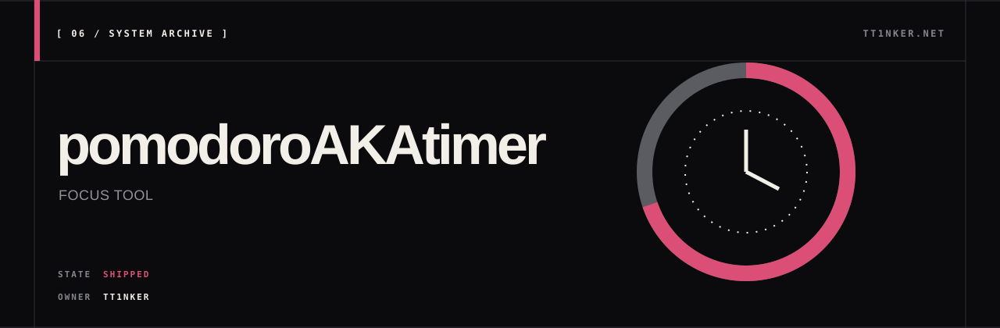

<p align="center">
  
</p>

<p align="center">
  <a href="https://ttinker.net">ttinker.net</a> ·
  <a href="https://ttinker.net/pomodoro/">open the timer</a> ·
  <a href="https://github.com/TT1nKer/pomodoroAKAtimer/releases/latest">music bridge</a>
</p>

# pomodoroAKAtimer

a minimalist pomodoro timer. single-file html, vue 3 bundled, runs offline.

**try it now** — no install, no signup:

→ <https://ttinker.net/pomodoro/>

| State | Evidence | Current boundary |
| --- | --- | --- |
| Shipped · browser app + `v0.1.2` bridge | Live GitHub Pages build; Linux, macOS ARM64, and Windows bridge assets | Browser state stays in `localStorage`; desktop media control is optional and platform-dependent |

## features

- custom session sequences (drag to reorder) + presets: classic / long / ultradian / sprint
- click the digits to edit time, scroll / arrow keys to ±1m
- focus stats — daily / weekly / monthly / yearly + last-30-days chart
- end-of-phase alert at three intensities — gentle / strong / persistent
- wake-lock keeps the screen on while running
- dynamic progress favicon, "ends at hh:mm" eta
- built-in ambient noise generator (white / pink / brown)
- optional desktop music integration (see below)
- offline-first; optional Google login beta syncs completed focus stats to ttinker.net

## keyboard

`space` start / pause · `n` next phase · `r` reset · `e` edit time · `↑`/`↓` ±1m (`shift` ±5m) · `s` session · `,` settings · `f` fullscreen

## music bridge (optional)

if you want the timer to show what's playing on your desktop music player
(spotify, apple music, netease cloud, mpd, browser players …) and let you
skip / pause from the timer ui, you need a tiny local daemon. browsers
can't read mpris / mediaremote / smtc directly.

### download the binary

grab the matching one from the latest release:

→ <https://github.com/TT1nKer/pomodoroAKAtimer/releases/latest>

| platform              | asset                                |
|-----------------------|--------------------------------------|
| linux x86_64          | `timer-bridge-linux-x86_64`          |
| macos apple silicon   | `timer-bridge-macos-aarch64`         |
| windows x86_64        | `timer-bridge-windows-x86_64.exe`    |

### run it

```sh
# linux / macos
chmod +x timer-bridge-*
./timer-bridge-*

# windows
./timer-bridge-windows-x86_64.exe
```

leave it running in a terminal. ctrl-c stops it.

then in the timer: **settings → music bridge → enable**. the status dot
turns green when it's reachable, red if not.

### platform notes

- **linux** uses `libdbus-1.so.3` at runtime — already on every desktop linux.
- **macos** shells out to [`nowplaying-cli`](https://github.com/kirtan-shah/nowplaying-cli) (`brew install nowplaying-cli`). mediaremote is a private framework; the cli already does the objc binding.
- **windows** uses the built-in smtc api — nothing extra to install.

### alternative: python script (linux only)

if you'd rather not download a binary, the source repo has a 30-line
python script that does the same thing on linux. clone the repo, then:

```sh
sudo pacman -S playerctl     # arch — adjust for your distro
python bridge.py             # ctrl-c to stop
```

### alternative: build from source

see [bridge-rs/README.md](bridge-rs/README.md). cargo build, single binary.

## hacking on it

```sh
git clone git@github.com:TT1nKer/pomodoroAKAtimer.git
cd pomodoroAKAtimer
# the entire app is index.html — open it directly, or:
python -m http.server 8000
```

```
index.html              the entire app
vue.global.prod.js      vue runtime (offline)
bridge.py               linux-only python daemon
bridge-rs/              cross-platform rust daemon
.github/workflows/      ci that builds binaries on tag push
```

new releases: tag `v*` and push — ci builds the three platforms and
attaches them to a github release.

## stats persistence

stats live in `localStorage` under the page's origin. that means:
- visiting via the live link (`tt1nker.github.io/...`) — stats persist forever for that URL
- opening `index.html` directly via `file://` — stats persist *for that exact path*; moving the file resets them
- serving locally via `python -m http.server` — stable origin, fine

The optional sync beta uses Google OAuth and stores completed focus entries in a
user-isolated SQLite database on `ttinker.net`. Local stats remain the offline
source and are merged after login; passwords and Google access tokens are not stored.

## license

mit.
